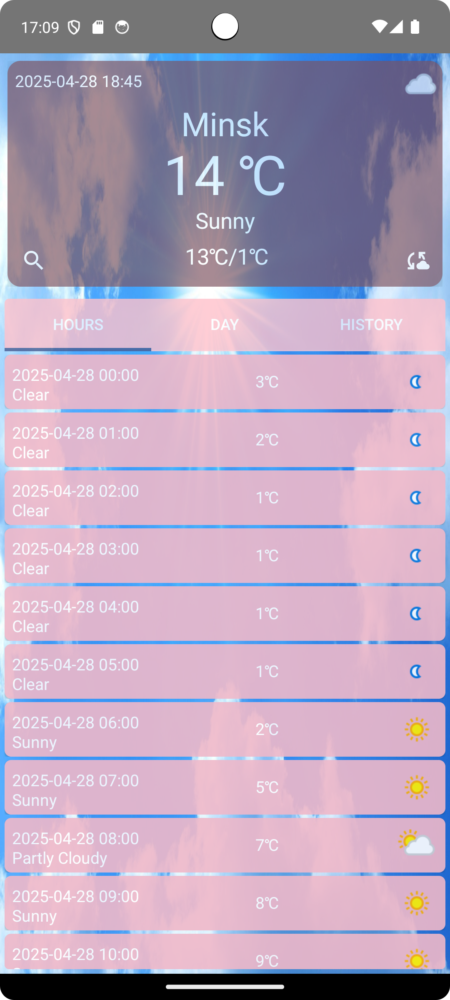

# SuperWeather

## Description
У природы нет плохой погоды! Нужно лишь знать как правильно к ней подготовиться. В этом Вам поможет наше приложение SuperWeather - Ваш незаменимый помощник для прогнозирования погодных условий.

Приложение предоставляет:
- Точные прогнозы погоды в реальном времени
- Подробную информацию по часам и дням
- Удобный интерфейс с историей поиска

## Installation
### Предварительные требования:

- Android Studio 2022.3.1 (Flamingo) или новее
- Android SDK:
  - Компиляция: Android 14 (API 35)
  - Минимальная версия: Android 10 (API 29)
  - Целевая версия: Android 14 (API 35)
- JDK 21
- Kotlin 1.9.0 или новее
- Gradle 8.0 или новее
- Устройство/эмулятор с Android 10 (API 29) или выше
- Доступ к интернету для загрузки зависимостей

### Для установки приложения выполните следующие шаги:

1. Клонируйте репозиторий:
```bash
      git clone https://github.com/fpmi-pmvs2025/pmvs11a-lab8-the-seal-army.git
      cd pmvs11a-lab8-the-seal-army
```

2. Откройте проект в Android Studio:
- Запустите Android Studio
- Выберите File → Open и укажите папку проекта
- Дождитесь завершения индексации и синхронизации Gradle (может занять несколько минут)

3. Запустите приложение:
- Подключите Android-устройство
  - Включите режим разработчика
  - Разрешите установку через USB
- Или создайте эмулятор с API 29+ через AVD Manager
- Нажмите кнопку "Run" (▶️) или Shift+F10
- Выберите ваше устройство из списка

## Usage
1. После установки приложения на главном экране отображается текущая погода (по умолчанию для Минска). 

2. Используйте иконку поиска 🔍 для выбора другого города. 

3. Переключайтесь между вкладками:

- HOURS: почасовой прогноз.
- DAY: прогноз на несколько дней.
- HISTORY:  ранее просмотренные города.

4. Для обновления данных нажмите иконку синхронизации.

Главный экран приложения



## Contributing
Авторы проекта:

- Кремко Тимофей: Менеджер проекта и руководитель группы, юнит-тестирование, интеграционные тесты, UI тесты, настройка Continuous Integration (GitHub Actions).
- Напреенко Станислав: Разработка основного функционала, реализация базы данных и работы с API, cоздание UI компонентов и навигации.
- Яшенок Алина: Дизайн интерфейса и иконок, контроль качества и тестирование, cоздание и поддержка документации (README, Wiki), настройка GitHub Pages.

Реализованные задачи:

- Интеграция с WeatherAPI.com
- История поиска городов
- Почасовой и многодневный прогноз
- Адаптивный UI для разных размеров экранов
- Система тестирования (юнит, UI тесты)
- CI/CD pipeline с GitHub Actions
- Документация проекта
