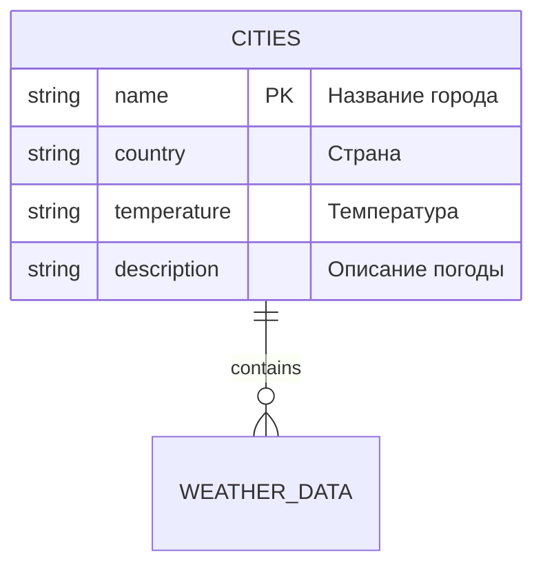

# Database Schema

## Структура базы данных

```mermaid
erDiagram
    CITIES ||--o{ WEATHER_DATA : contains
    CITIES {
        string name PK "Название города"
        string country "Страна"
        string temperature "Температура"
        string description "Описание погоды"
    }
```
## SQL-файл
[SQL](https://github.com/fpmi-pmvs2025/pmvs11a-lab8-the-seal-army/blob/docs/assets/Database/script.sql)