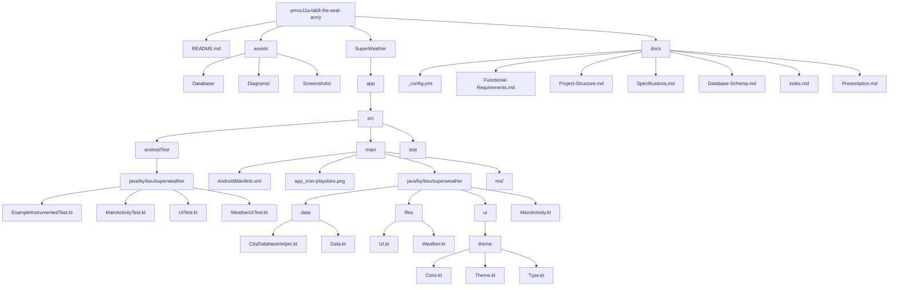
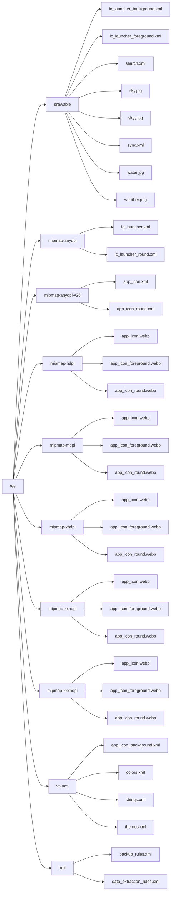

# Диаграмма файлов приложения SuperWeather

## Основная структура проекта

## Ключевые директории и файлы

### 1. Модуль данных (`data/`)

| Файл                  | Назначение                                                                 |
|-----------------------|---------------------------------------------------------------------------|
| `CityDatabaseHelper.kt` | **Управление SQLite БД**:<br>- Создание/обновление таблиц<br>- Кэширование городов<br>- Работа с историей поиска |
| `Data.kt`              | **Модель данных погоды**:<br>- Поля: `city`, `time`, `temp` и др.<br>- Парсинг JSON из API |

### 2. UI компоненты (`files/`)

| Компонент            | Функционал                                                                 |
|----------------------|---------------------------------------------------------------------------|
| `UI.kt`        | **Утилиты для UI**:<br>-  Компоненты оформления и элементов интерфейса |
| `Weather.kt`       | **Отображение погоды**:<br>- Обработка погодных данных для показа в UI                                 |

### 3. Ресурсы (res/)


### 4. Тесты (src/test/)


## Полная структура
```gherkin
pmvs11a-lab8-the-seal-army/
├── README.md
├── assets/
│   ├── Database/
│   │   
│   ├── Diagrams/
│   │  
│   └── Screenshots/
│       
├── docs/
│   ├── _config.yml
│   ├── index.md
│   ├── Functional-Requirements.md
│   ├── Project-Structure.md
│   ├── Specifications.md
│   ├── Presentation.md
│   └── Database-Schema.md
└── SuperWeather/
    └── app/
        └── src/
            ├── androidTest/
            │   └── java/by/bsu/superweather/
            │       ├── ExampleInstrumentedTest.kt
            │       ├── MainActivityTest.kt
            │       ├── UITest.kt
            │       └── WeatherUITest.kt
            ├── main/
            │   ├── AndroidManifest.xml
            │   ├── app_icon-playstore.png
            │   ├── java/by/bsu/superweather/
            │   │   ├── data/
            │   │   │   ├── CityDatabaseHelper.kt
            │   │   │   └── Data.kt
            │   │   ├── files/
            │   │   │   ├── UI.kt
            │   │   │   └── Weather.kt
            │   │   ├── ui/
            │   │   │   └── theme/
            │   │   │       ├── Color.kt
            │   │   │       ├── Theme.kt
            │   │   │       └── Type.kt
            │   │   └── MainActivity.kt
            │   └── res/
            │       
            └── test/
                └── java/by/bsu/superweather/
                    ├── CityDatabaseHelperTest.kt
                    ├── DataTest.kt
                    ├── ExampleUnitTest.kt
                    └── WeatherTest.kt
    
```